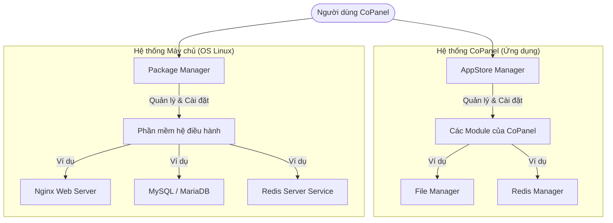

# Báo cáo Phân tích: So sánh AppStore-Manager và Package Manager trong CoPanel

Tài liệu này phân tích chi tiết vai trò, điểm giống và khác nhau, cùng sự kết hợp của hai hệ thống quản lý chính trong CoPanel: **AppStore-Manager** và **Package Manager**.

---

## 1. Tổng quan về hai hệ thống

---

## 2. Bảng so sánh chi tiết

| Tiêu chí | AppStore-Manager | Package Manager |
| :--- | :--- | :--- |
| **Đối tượng quản lý** | Các Module/Tiện ích chạy trực tiếp bên trong CoPanel. | Các gói phần mềm, dịch vụ hệ điều hành (OS Level). |
| **Mục đích chính** | Mở rộng tính năng và giao diện của CoPanel (Ví dụ: Thêm trang Redis, công cụ Ping Pro). | Cài đặt và quản lý phần mềm máy chủ (Ví dụ: Cài đặt PHP, MySQL, Nginx, UFW). |
| **Cách thức hoạt động** | Tải mã nguồn (.zip) từ GitHub -> Giải nén vào `backend/modules` và `frontend/modules` -> Chạy `npm run build` để cập nhật giao diện. | Chạy các lệnh hệ điều hành thông qua terminal Linux (`apt install`, `yum install`, hoặc các script tự động của CoPanel). |
| **Phạm vi ảnh hưởng** | Chỉ tác động đến giao diện và các API xử lý bên trong CoPanel. | Tác động toàn diện đến toàn bộ hệ thống máy chủ và VPS. |
| **Người bảo trì** | Đội ngũ phát triển CoPanel và các nhà phát triển module bên thứ ba. | Các nhà phát triển hệ điều hành (Ubuntu/Debian) và phần mềm mã nguồn mở. |
| **Trạng thái lưu trữ** | Kiểm tra sự tồn tại của thư mục module và đối chiếu qua `packages.json` (Local Version vs Remote Version). | Kiểm tra dịch vụ hệ thống đang chạy (`systemctl status`) hoặc truy vấn qua câu lệnh OS. |

---

## 3. Sự bổ trợ lẫn nhau giữa hai hệ thống

Để tối ưu hóa trải nghiệm người dùng trên CoPanel, hai hệ thống này cần được thiết kế hoạt động đồng bộ và hỗ trợ lẫn nhau:

### Kịch bản 1: Cài đặt và sử dụng một module mở rộng
1. Người dùng vào **AppStore Manager** để cài đặt module **Redis Cache Manager**.
2. Khi module được tải về và cài đặt vào CoPanel, nó sẽ cung cấp một giao diện quản lý trực quan cho Redis.
3. Tuy nhiên, nếu trên VPS chưa cài đặt Redis Server, module này sẽ không thể hoạt động.
4. Lúc này, giao diện của **Redis Cache Manager** có thể phát hiện Redis chưa được cài đặt và điều hướng người dùng sang **Package Manager** để cài đặt Redis Server lên OS.

### Kịch bản 2: Cài đặt ứng dụng từ Core Modules
1. Người dùng vào **Web Manager** để tạo một website mới.
2. Để website chạy được, hệ thống cần các gói `Nginx`, `MySQL`, và `PHP-FPM`.
3. **Web Manager** (thuộc AppStore) sẽ gọi các script hoặc API của **Package Manager** để kiểm tra và cài đặt các gói phần mềm tương ứng lên VPS.

---

## 4. Đề xuất quy chuẩn phát triển (Best Practices)

Để tránh nhầm lẫn cho người dùng khi vận hành CoPanel, cần làm rõ các điểm sau trong thiết kế giao diện:

- **Sử dụng từ ngữ chính xác**: 
  - Tại **AppStore**: Sử dụng các từ ngữ như *"Extension"*, *"Module"*, *"Tiện ích mở rộng"*, *"Ứng dụng CoPanel"*.
  - Tại **Package Manager**: Sử dụng các từ ngữ như *"Service"*, *"Dịch vụ"*, *"Gói phần mềm máy chủ"*, *"Phần mềm VPS"*.
- **Liên kết điều hướng thông minh**: Khi một Module CoPanel yêu cầu dịch vụ hệ thống chưa được cài đặt, hãy hiển thị nút *"Đi đến Package Manager để cài đặt [Tên phần mềm]"*.
- **Tách biệt quyền hạn**: Việc cài đặt module qua AppStore chỉ ảnh hưởng đến frontend/backend của CoPanel, trong khi Package Manager yêu cầu quyền `sudo`/`root` của máy chủ.

---

## 5. Kết luận

- **AppStore Manager** là cầu nối giúp **CoPanel luôn có thể mở rộng tính năng** một cách linh hoạt, giao diện đẹp mắt mà không cần can thiệp sâu vào hệ điều hành.
- **Package Manager** là xương sống giúp **quản lý và vận hành toàn bộ dịch vụ cốt lõi** trên máy chủ Linux.
- Sự kết hợp chặt chẽ giữa hai hệ thống sẽ mang lại một hệ sinh thái quản trị máy chủ VPS cực kỳ mạnh mẽ, toàn diện và tiện lợi.
